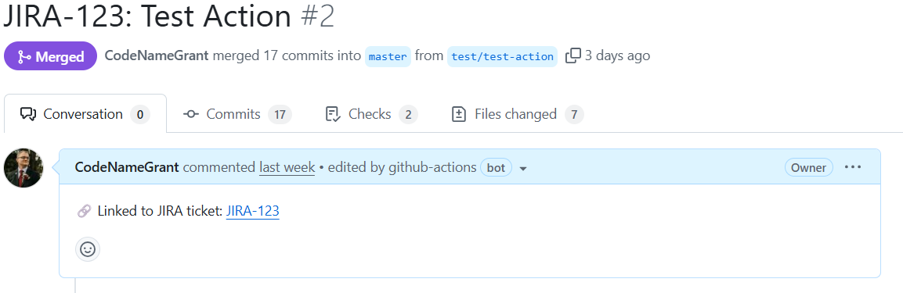

# JIRA PR Link Action

Automatically adds, updates, or removes JIRA ticket links in GitHub pull requests based on the PR title.

## Inputs

| Name             | Required | Description                                                                                                                          |
| ---------------- | -------- | ------------------------------------------------------------------------------------------------------------------------------------ |
| `token`          | ✅       | GitHub token, usually `${{ secrets.GITHUB_TOKEN }}`                                                                                  |
| `jira-base-url`  | ✅       | Base JIRA URL (e.g., `https://yourcompany.atlassian.net`)                                                                            |
| `jira-link-mode` | ❌       | Where to add the JIRA link in the PR body: `"body-start"` (default) or `"body-end"`                                                  |
| `issue-pattern`  | ❌       | Optional custom regex to match JIRA issues. Must include exactly one capturing group for the ticket. Default: ([A-Z][A-Z0-9_]\*-\d+) |

## Required Permissions

This action needs the following GitHub token permissions to run successfully:

- **`contents: read`** — Required to read repository content and pull request data.
- **`pull-requests: write`** — Required to update the pull request body or other PR attributes.

By default, GitHub Actions provides a `GITHUB_TOKEN` with read/write access to your repository.  
If you are running this action in a restricted environment, ensure that these minimum permissions are granted to the `GITHUB_TOKEN` or any personal access token you use.

## Demo



## Example Workflow

```yaml
name: Add JIRA Links
on:
  pull_request:
    types: [opened, edited, reopened]

permissions:
  contents: read
  pull-requests: write

jobs:
  add-jira-links:
    runs-on: ubuntu-latest
    steps:
      - uses: codenamegrant/jira-pr-link-action@v1
        with:
          github-token: ${{ secrets.GITHUB_TOKEN }}
          jira-base-url: 'https://yourcompany.atlassian.net'
          jira-link-mode: 'body-start'
          issue-pattern: '(MyProject-\d+)'
```
